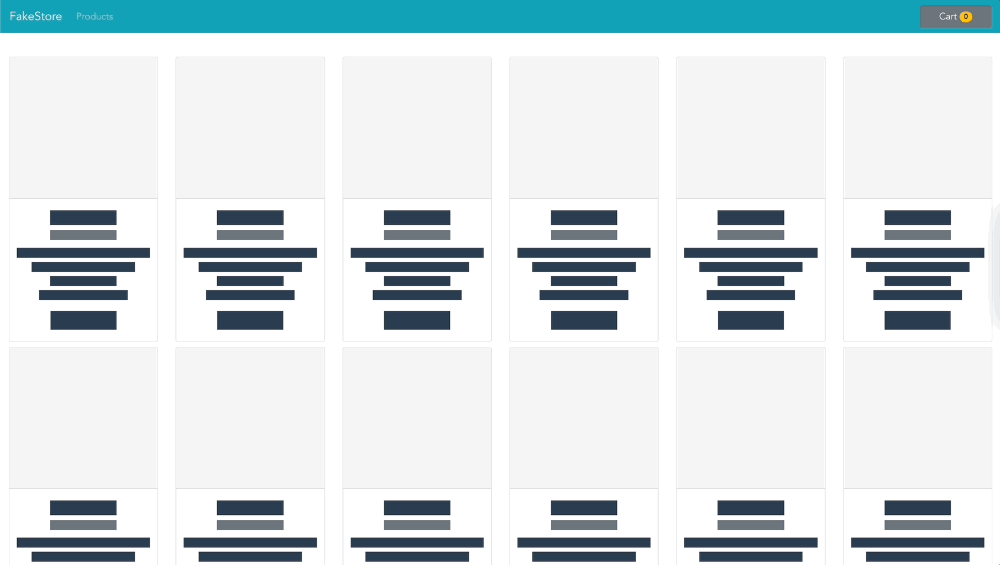

# Vue.js Fake Store



## Overview

This application is a simple Vue.js app mimicking the basic functionality of an e-commerce client. It was built with the following motivations:

* Gain familiarity and understanding of building a basic Vue.js application
* Prepare a finished example for a mock front-end interview for candidates to practice a Vue-oriented interview exercise

Instructions for the front-end exercise can be found in the `instructions.txt` file. Products are fetched using the [Fake Store API](https://fakestoreapi.com/).

## Tools and Packages

* Vue (2.6.14)
* Pinia (2.1.7)
* Vue-router (3.6.5)
* Vue-shimmer (1.0.0)
* Bootstrap-vue (2.23.1)
* Cypress (13.6.1)

## Project setup
```
npm install
vue serve
```

## Running tests
```
npx cypress open
```